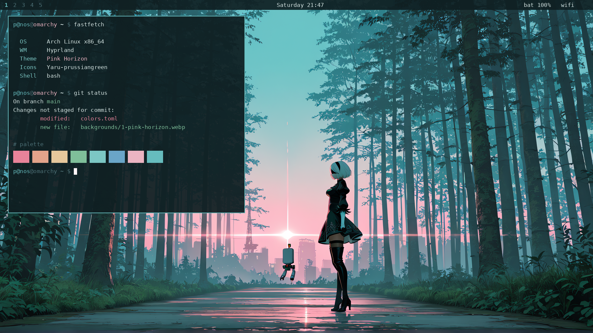
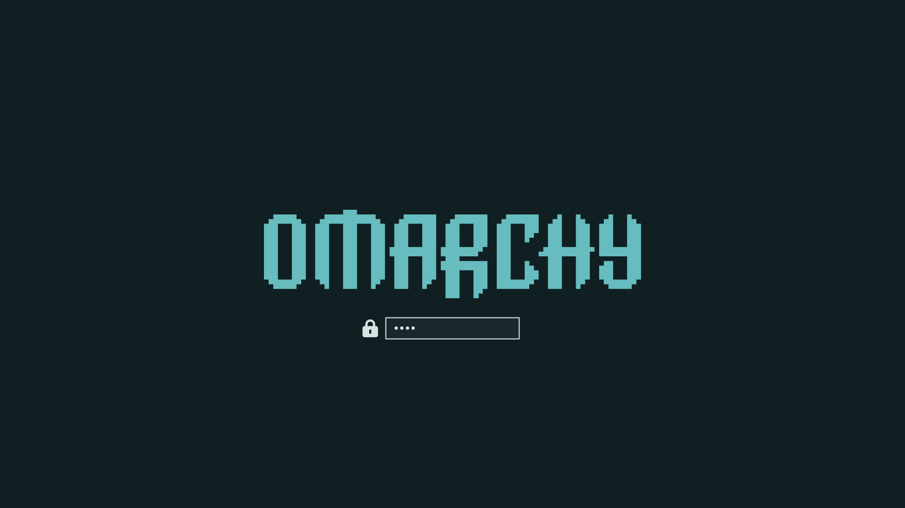

<div align="center">

# Pink Horizon

**A dark teal-and-pink theme for [Omarchy](https://omarchy.org)**

Misty teal forest. Pink sunset glow. Three 4K wallpapers.




</div>

---

## Contents

- [Installation](#installation)
- [Screenshots](#screenshots)
- [Wallpapers](#wallpapers)
- [What gets themed](#what-gets-themed)
- [Extras: cliamp, Zen Browser, foot](#extras)
- [Palette](#palette)
- [Updating and removing](#updating-and-removing)
- [Troubleshooting](#troubleshooting)
- [Credits and license](#credits-and-license)

---

## Installation

> Requires a recent version of [Omarchy](https://omarchy.org) (tested on Omarchy 4).

### Option 1: Omarchy menu (recommended)

1. Press <kbd>Super</kbd> + <kbd>Alt</kbd> + <kbd>Space</kbd> to open the Omarchy menu.
2. Go to **Install → Style → Theme**.
3. Paste this URL and press <kbd>Enter</kbd>:

   ```
   https://github.com/padou-dev/omarchy-pink-horizon-theme.git
   ```

The theme is downloaded to `~/.config/omarchy/themes/pink-horizon` and applied right away.

### Option 2: Terminal

```bash
omarchy-theme-install https://github.com/padou-dev/omarchy-pink-horizon-theme.git
```

### Switching themes later

Open the theme picker with <kbd>Super</kbd> + <kbd>Ctrl</kbd> + <kbd>Shift</kbd> + <kbd>Space</kbd> and choose **Pink Horizon** (or any other theme).

---

## Screenshots

| Desktop | Boot / unlock screen |
| :--: | :--: |
|  |  |

---

## Wallpapers

All wallpapers are **3840 × 2160**. Switch between them with the background picker: <kbd>Super</kbd> + <kbd>Ctrl</kbd> + <kbd>Space</kbd>.

| | |
| :--: | :--: |
|  |  |
| **1 · Pink Horizon** | **2 · Still Lake** |
|  | |
| **3 · Pink Ridges** | |

---

## What gets themed

Omarchy generates every app's colors from this theme's single `colors.toml`, so all of these match automatically:

| Area | Apps |
|---|---|
| Desktop | Hyprland window borders (teal gradient), Omarchy shell: bar, launcher, notifications, OSD, lock screen |
| Terminals | Alacritty, Ghostty, Kitty, Foot |
| Editors | Neovim, VS Code, Helix, Obsidian |
| Browsers | Chromium, Brave, Brave Origin (toolbar color) |
| System | btop, GTK icons (Yaru-prussiangreen), Plymouth boot screen |

---

## Extras

Some apps aren't themed by Omarchy itself. For these the repo ships ready-made files in [`extras/`](extras). Each needs a one-time setup.

<details>
<summary><b>cliamp</b> (terminal music player)</summary>

<br>

Link cliamp to the active Omarchy theme. This theme ships a `cliamp.toml`, so cliamp gets Pink Horizon's colors:

```bash
mkdir -p ~/.config/cliamp/themes
ln -sf ~/.local/state/omarchy/current/theme/cliamp.toml ~/.config/cliamp/themes/omarchy.toml
```

Then open cliamp, press <kbd>t</kbd> and pick **omarchy**, or set `theme = "omarchy"` in `~/.config/cliamp/config.toml`.

If you'd rather not link it, copy the file directly:

```bash
cp ~/.config/omarchy/themes/pink-horizon/extras/cliamp/pink-horizon.toml ~/.config/cliamp/themes/
```

</details>

<details>
<summary><b>Zen Browser</b></summary>

<br>

1. Open `about:config` and set `toolkit.legacyUserProfileCustomizations.stylesheets` to **true**.
2. Open `about:support`, then click **Profile Folder → Open Folder**.
3. Create a folder named `chrome` inside the profile folder.
4. Copy both CSS files into it:

   ```bash
   cp ~/.config/omarchy/themes/pink-horizon/extras/zen/*.css /path/to/zen/profile/chrome/
   ```

5. Make sure Zen is in dark mode, then restart it.

</details>

<details>
<summary><b>foot</b> (outside Omarchy)</summary>

<br>

On Omarchy, foot is themed automatically. For foot on another system, copy `extras/foot/pink-horizon.ini` to `~/.config/foot/` and add this line to `~/.config/foot/foot.ini`:

```ini
include=~/.config/foot/pink-horizon.ini
```

</details>

---

## Palette

| | Role | Hex | | Role | Hex |
|:-:|---|---|:-:|---|---|
|  | background | `#0f1f22` |  | red | `#e8839a` |
|  | foreground | `#d6e5e3` |  | orange | `#e3a38a` |
|  | accent | `#66bcbe` |  | yellow | `#e6c79c` |
|  | selection | `#24474d` |  | green | `#7fbf9a` |
|  | muted | `#4d7076` |  | cyan | `#7cc7c4` |
|  | bright foreground | `#fdf4f6` |  | blue | `#6aa5c8` |
| | | |  | magenta | `#ebb4c2` |

---

## Updating and removing

| Task | Omarchy menu | Terminal |
|---|---|---|
| Update to the latest version | **Update → Extra Themes** | `omarchy-theme-update` |
| Remove the theme | **Remove → Theme** | `omarchy-theme-remove pink-horizon` |

---

## Troubleshooting

<details>
<summary><b>Install fails with "Failed to clone theme repo"</b></summary>

Check your internet connection and that the URL is exactly `https://github.com/padou-dev/omarchy-pink-horizon-theme.git`.
</details>

<details>
<summary><b>A terminal didn't change color</b></summary>

Close and reopen it. Some terminals only read their colors at launch.
</details>

<details>
<summary><b>"Ignored in … : …" message after installing</b></summary>

Omarchy never loads terminal configs or Lua files from themes installed via git. This theme doesn't ship any, so you shouldn't see this. If you do, run the update command above.
</details>

<details>
<summary><b>Icons didn't change</b></summary>

Check that the icon set is installed: `ls /usr/share/icons | grep -i yaru`.
</details>

<details>
<summary><b>cliamp shows its default colors</b></summary>

Check that the link points to a real file: `ls -l ~/.config/cliamp/themes/omarchy.toml`. It only resolves while Pink Horizon (or another theme that ships `cliamp.toml`) is active.
</details>

---

## Repository layout

```
.
├── backgrounds/          4K wallpapers (+ omarchy.webp logo backdrop)
├── extras/               manual-setup themes: cliamp, Zen Browser, foot
├── media/                README thumbnails
├── colors.toml           the palette every themed app is generated from
├── cliamp.toml           cliamp colors
├── icons.theme           icon set name
├── preview.png           theme-picker thumbnail
├── preview-unlock.png    boot/unlock screen preview
└── unlock.png            boot/unlock logo
```

---

## Credits and license

- Theme and wallpapers by **[p@nos](https://github.com/padou-dev)**.
- Wallpaper 1 was upscaled to 4K with [Real-ESRGAN](https://github.com/xinntao/Real-ESRGAN). It is fan art featuring characters from *NIER:AUTOMATA* (© SQUARE ENIX). This project is not affiliated with or endorsed by Square Enix.
- Wallpapers 2–3 were generated procedurally for this theme.
- Built on the theme system of [basecamp/omarchy](https://github.com/basecamp/omarchy). The Zen styling follows the approach of [catppuccin/zen-browser](https://github.com/catppuccin/zen-browser).

Theme files are released under the [MIT License](LICENSE). Wallpaper 1 is excluded from the MIT License.
